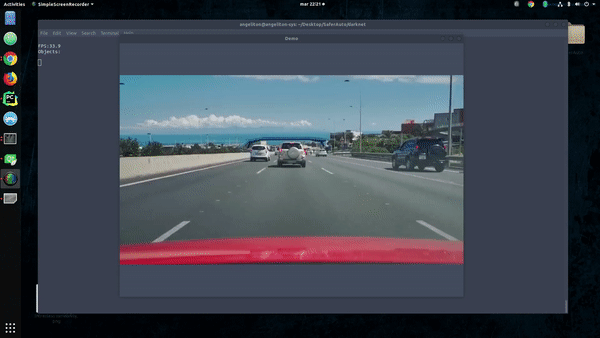

<p align="center">
    
</p>
<h1 align="center">Safer Auto</h1>
<h4 align="center">Real-time detection system to assist during driving. </h4>

<p align="center">
  <a href="https://github.com/angeligareta/SaferAuto/blob/master/LICENSE">
    
  </a>
  <a href="https://saferauto.home.blog/">
    
  </a>
  <a href="https://twitter.com/SaferAuto">
    
  </a>
  <a href="https://github.com/ellerbrock/open-source-badges/">
    
  </a>
</p>


<p align="center">
  <a href="#key-features">Key Features</a> •
  <a href="#how-to-use">How To Use</a> •
  <a href="#author">Author</a> •
  <a href="#license">License</a>
</p>

Detect, locate and track road elements from a video stream using **[YOLOv3](https://pjreddie.com/darknet/yolo/) real-time object detection system**. Among the elements to classify, the model will be trained to detect traffic lights, vehicles and some types of road signs.

## Key Features
* Detection of speed limit road signs and speed identification. ✔️
* Detection of traffic lights and classification depending on its state (green, amber, red). *[work in progress]*
* Detection of cars and classification of the type. *[work in progress]*
* Detect the previous elements in real-time. ✔️
* Track the previous elements in real-time. *[work in progress]*
* Implementation of a chatbot that notifies the driver of possible road threats and is able to repeat last notifications. *[work in progress]*
* UI that displays the current detection and tracking of the road elements, showing bounding boxes with the different classes. ✔️

## How to use
For the moment, there is only a command-line program to test the traffic sign detector. It receives a video stream and plays the video while it indicates the bounding boxes of the different classes that the YOLO model detects. 

For running this program script you need to have [python3 installed](https://www.python.org/downloads/). Besides, you need to download the [weights file](https://drive.google.com/uc?export=download&confirm=Yp2w&id=1Ddvmwn9WcB__jocW70piDeWzyvGbqUP5) that represents the trained model. Finally, you only have to follow these steps:
```
git clone https://github.com/angeligareta/SaferAuto.git
cd SaferAuto/darknet/
mv <downloaded-weights> .
python3 darknet_video.py
```
The output would be similar to this one:


*Coming soon*: The next feature to release will be to add a UI to show the detection a more user-friendly.

## Author
[**Ángel Igareta**](https://github.com/angeligareta) - Computer Engineering Student

## License
This project is licensed under the **[MIT License](LICENSE)**
